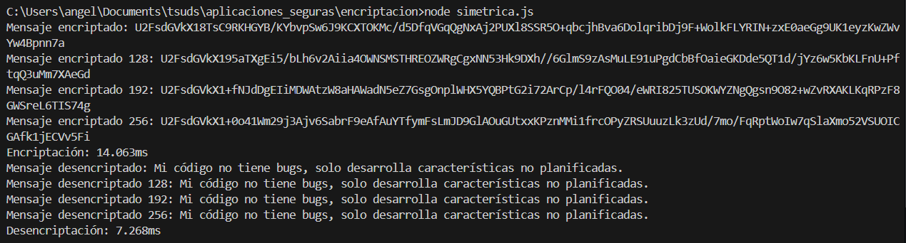
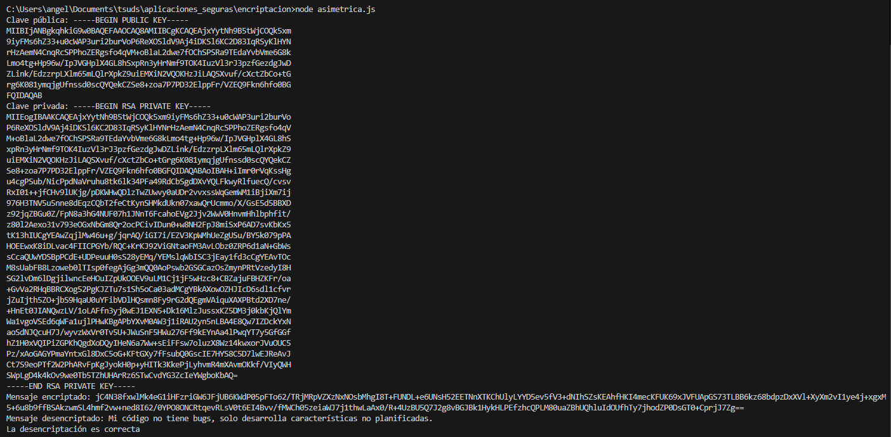
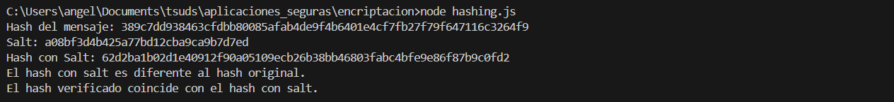
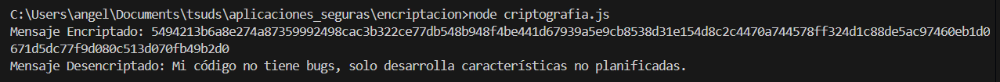
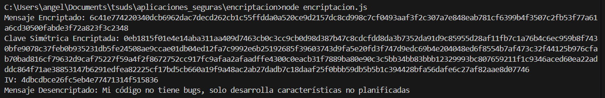

# Encriptación

Estos ejercicios están desarrollados con JavaScript y Node.js

## Instalacion de dependencias

Antes de empezar hay que instalar las dependencias del proyecto, puedes ejecutar el siguente comando desde la consola

```bash
npm install
```

## Encriptación Simétrica

AES (Advanced Encryption Standard) es uno de los algoritmos más seguros para encriptación simétrica. Utiliza una sola clave tanto para encriptar como para desencriptar la información.

### Ejecutar código

El código correspondiente está documentado en el archivo `simetrica.js`

```bash
node simetrica.js
```



### Explicación

**Encriptación:** Uso CryptoJS.AES.encrypt() para encriptar el mensaje, y lo convertirlo a una cadena de texto.

**Desencriptación**: Utilizo CryptoJS.AES.decrypt() para desencriptar el mensaje encriptado, y luego lo convertirlo a formato UTF-8 para obtener el texto original.

> **Nota:** La clave de encriptación debe mantenerse en secreto para garantizar la seguridad. Puedes ajustar el tamaño de la clave para cumplir con los tamaños de 128, 192 o 256 bits.


## Encriptación Asimétrica

La encriptación asimétrica utiliza un par de claves: una clave pública (para encriptar) y una clave privada (para desencriptar). RSA es uno de los algoritmos más comunes para este tipo de encriptación.

### Ejecutar código

El código correspondiente está documentado en el archivo `asimetrica.js`

```bash
node asimetrica.js
```



### Explicación

**Generación de Claves:** Primero, generamos un par de claves RSA (pública y privada) de 512 bits. Puedes aumentar el tamaño a 2048 o 4096 bits para una mayor seguridad.

**Encriptación:** Encriptamos el mensaje utilizando la clave pública. Esto permite que solo la persona con la clave privada pueda desencriptarlo.

**Desencriptación:** Usamos la clave privada para desencriptar el mensaje y obtener el texto original.

> **Nota:** En un entorno de producción, las claves pública y privada deben gestionarse de manera segura. Normalmente, se guarda la clave privada en un lugar seguro y la clave pública se distribuye a quien necesite encriptar información para enviártela.


## Hashing

 El hashing es diferente de la encriptación, ya que se trata de un proceso unidireccional. Esto significa que un hash no se puede "desencriptar" para obtener el valor original. Los algoritmos de hashing son ampliamente utilizados para verificar integridad de datos y almacenar contraseñas.

### Ejecutar código

El código correspondiente está documentado en el archivo `hashing.js`

```bash
node hashing.js
```



### Explicación

**Creación del Hash:** Utilizamos crypto.createHash('sha256') para crear un objeto de hash con el algoritmo SHA-256.

**Actualizar con el Mensaje:** Llamamos a update(mensaje) para proporcionar el texto a hashear.

**Digest:** digest('hex') genera la representación hexadecimal del hash. Puedes usar otros formatos como base64 si lo prefieres.

> El resultado es un valor hash único y fijo que representa el contenido del mensaje, ideal para almacenamiento seguro de contraseñas (junto con un salt para mayor seguridad) o para verificar integridad de datos.


## Criptografía de Flujo (Stream Cipher)

Los cifradores de flujo encriptan los datos bit a bit o byte a byte, en lugar de hacerlo en bloques como los cifradores de bloque. Esto permite un procesamiento continuo de los datos y es común en sistemas donde se requiere velocidad y bajo retraso, como en el cifrado de datos en transmisión.

### Ejecutar código

El código correspondiente está documentado en el archivo `criptografia.js`

```bash
node criptografia.js
```



### Explicación

**Configuración del Algoritmo y Claves:** Estamos usando AES con una clave de 256 bits (32 bytes) y un vector de inicialización (IV) de 16 bytes.

**Encriptación:**

- Creamos un cipher (cifrador) usando el algoritmo AES-CTR, la clave y el IV.

- Encriptamos el mensaje y convertimos el resultado en un formato hexadecimal para guardarlo o transmitirlo.

**Desencriptación:**

- Creamos un decipher (descifrador) usando los mismos parámetros (algoritmo, clave y IV).

- Convertimos el mensaje encriptado desde hexadecimal a un Buffer, y luego lo desciframos para obtener el mensaje original.

> **Nota:** En un entorno de producción, es crucial almacenar o transmitir el IV junto con el mensaje encriptado, ya que es necesario para la desencriptación. Sin embargo, el IV no necesita mantenerse en secreto, a diferencia de la clave de encriptación.


## Encriptación Híbrida

La encriptación híbrida combina encriptación simétrica y asimétrica para aprovechar lo mejor de ambos mundos. En este sistema, se genera una clave simétrica aleatoria para cifrar el mensaje, y luego esta clave se cifra usando criptografía asimétrica con la clave pública del receptor. 

Esto permite:

- **Seguridad y velocidad:** La encriptación simétrica es rápida y eficiente para cifrar grandes volúmenes de datos.

- **Protección de la clave:** La clave simétrica, que es crítica para descifrar el mensaje, se protege con encriptación asimétrica.

### Código

El código correspondiente está documentado en el archivo `encriptacion.js`

```bash
node encriptacion.js
```



### Explicación

**Generación de Claves RSA:** Para el ejemplo, generamos claves pública y privada usando crypto.generateKeyPairSync. En un entorno real, usarías claves RSA ya generadas y almacenadas en archivos.

**Encriptación Simétrica del Mensaje:** Utilizamos AES en modo CTR para encriptar el mensaje con una clave y IV aleatorios.

**Encriptación de la Clave Simétrica con RSA:** La clave simétrica se encripta utilizando la clave pública RSA del receptor, lo que permite protegerla.

**Desencriptación de la Clave Simétrica:** Al desencriptar, usamos la clave privada del receptor para recuperar la clave simétrica original.

**Desencriptación del Mensaje:** Usamos la clave simétrica para desencriptar el mensaje original.


## Autor

Desarrollado por:  [Angel Lucero](https://angelluce.github.io/cv/).

[](https://www.linkedin.com/in/angellucero/)
[](https://github.com/angelluce)
[](https://gitlab.com/angellucero)
